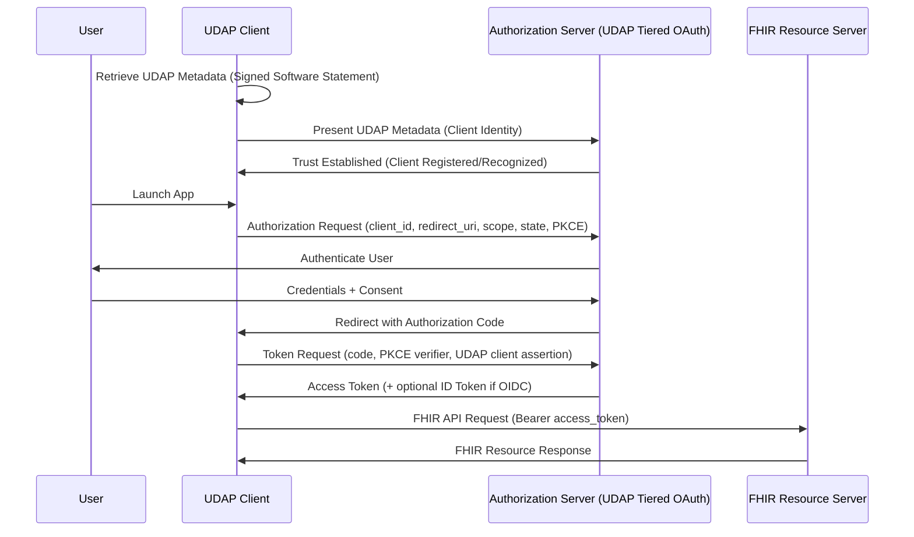
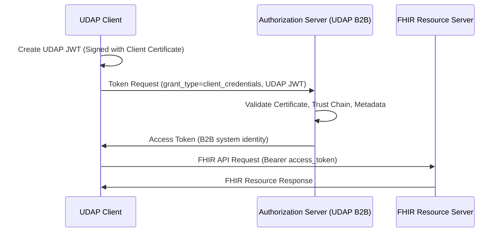
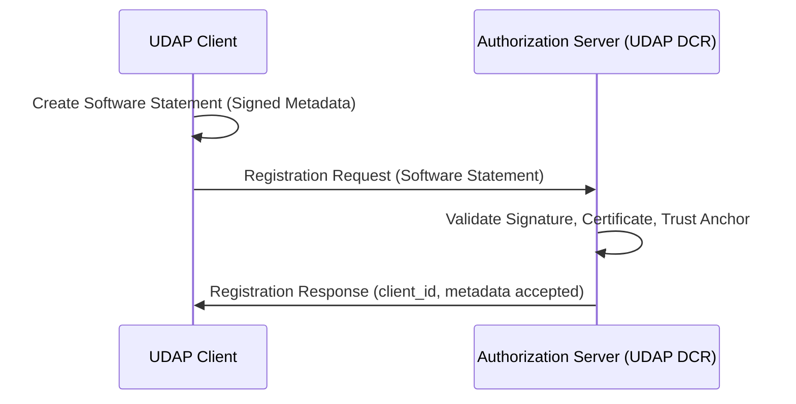
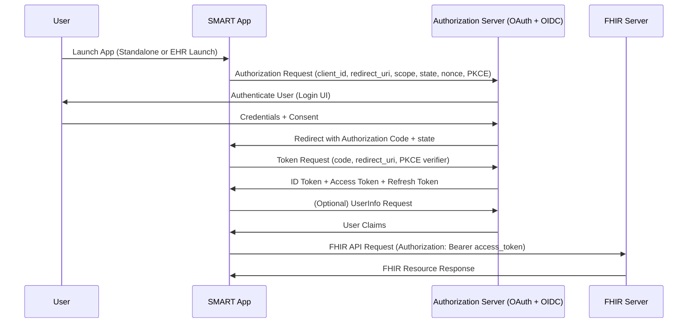
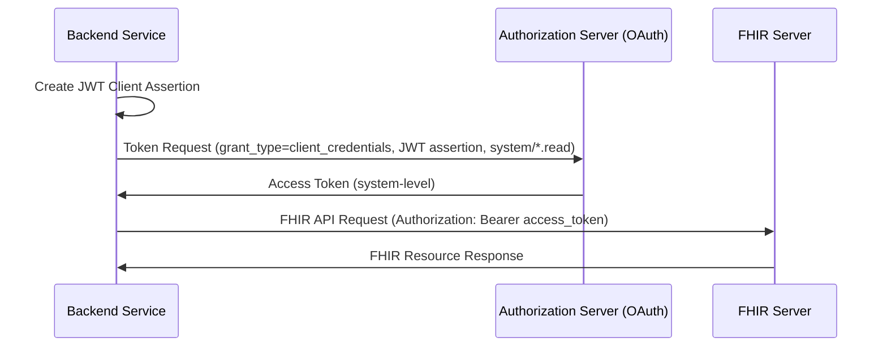
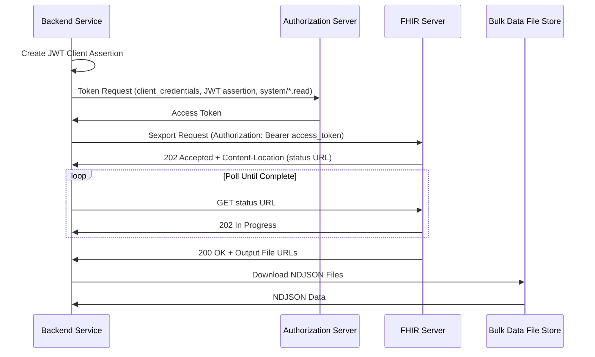
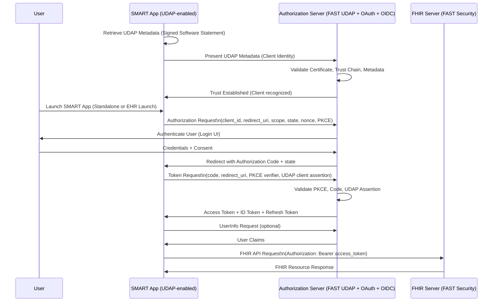
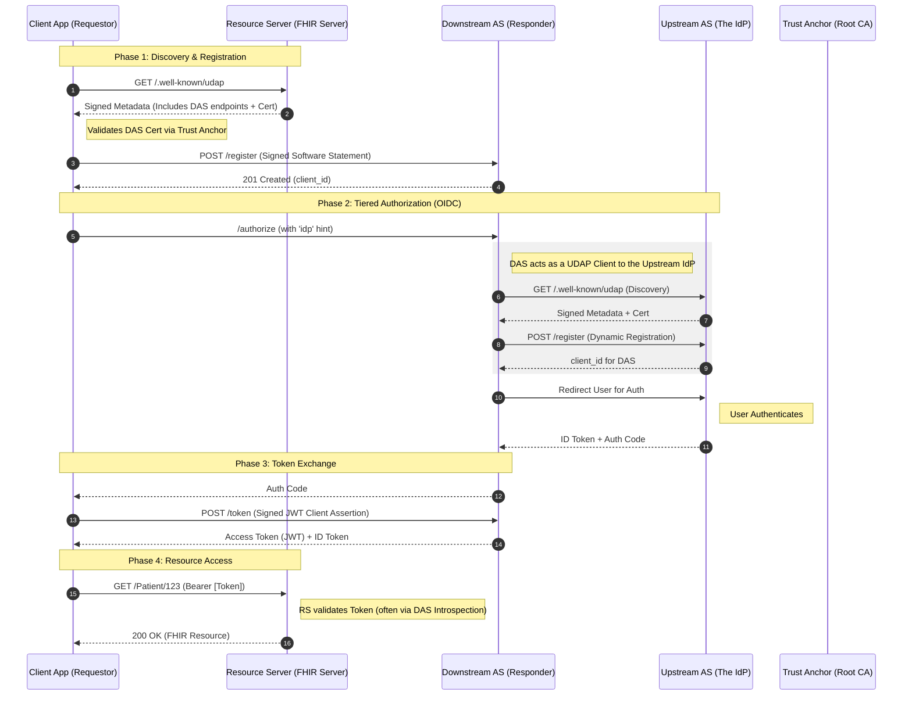
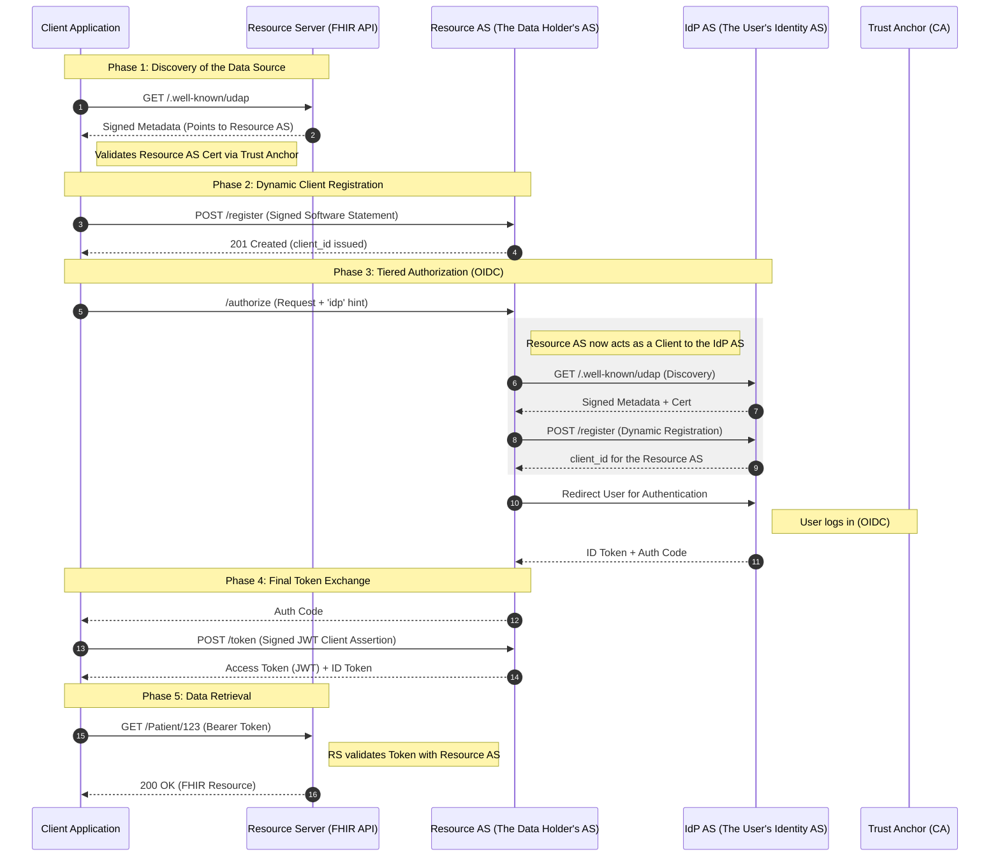
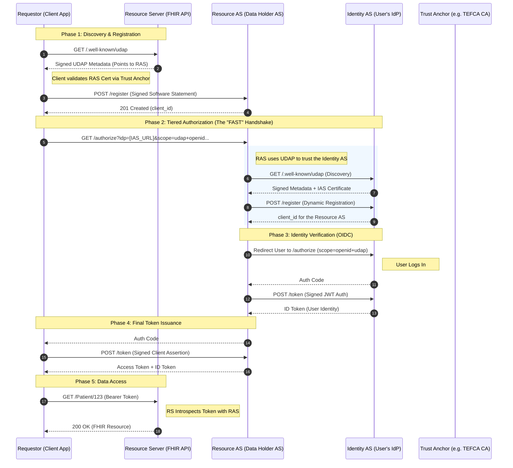

# Notes by John Moehrke

IG CI - https://build.fhir.org/ig/HL7/fhir-udap-security-ig/index.html

## Issues

- There is no use-case documentation. What is the problem that this IG is trying to solve or support?
- There is no overall flow diagram that shows the relationship of the Discovery, Registration, and Authorization steps
- on the AA pages, there are single step flow diagrams, but the multiple steps are not shown in a single diagram. This makes it difficult to understand how the steps relate to each other and to the overall flow.
- How would one combine FAST Security and SMART App Launch OAuth flows?
  - can one combine the well-known configuration for both? This was presented as a possible simplification by Josh.
- I understand the need to use OAuth terms (Authorization Code Flow, ) The introduction should present these in use-case terms without OAuth jargon. 
  - For example, "A client application needs to obtain permission from a user to access their health data. This process involves several steps, including discovering the necessary endpoints, registering the application, and obtaining authorization from the user."
- Similarly the four menus under "Authorization and Authentication" are never explained in the text. They are just there. The text should explain what they are and how they relate to the overall flow.
- Possible FHIR artifact, even as informative, would be an AuditEvent or set of AuditEvent that represent relevant security events in the flow. For example, an AuditEvent for discovery, registration, and authorization steps. This would be useful for implementers to understand what events to log and how to log them.

## Reference Implementation

- Joe Shook [UDAP Ed](https://udaped.fhirlabs.net/)
- Joe Shook [Reference Implementation for .NET](https://github.com/udap-tools/udap-dotnet)
- [HL7-FAST / udap - FAST Security RI](https://udap-security.fast.hl7.org/docs/guides/integration/)
- [UDAP - Security.FAST.hl7.org](https://udap-security.fast.hl7.org/)

### Tutorial

- [TEFCA SOP Facilitated FHIR Implementation](https://rce.sequoiaproject.org/wp-content/uploads/2026/02/SOP-Facilitated-FHIR-Implementation-2.0-Draft-508.pdf)
- Joe Shook [Set up a local UDAP playground, which includes a FHIR server, a static certificates server, a UDAP Auth Server, and a UDAP IDP Server.](https://github.com/JoeShook/udap-dotnet-tutorial)
- 
- 
## Testing

- [UDAP.org test tool](https://www.udap.org/UDAPTestTool/)

## Overall Flow

### FAST UDAP Tiered OAuth (User-present Authorization Code)

### FAST UDAP B2B (Client Credentials, No User)

### FAST UDAP Dynamic Client Registration (UDAP DCR)

### SMART App Launch: OAuth → OIDC → SMART App Launch

### SMART Backend Services (Bulk Data)

### Bulk Data Access - Flat FHIR

### Combined FAST Security + SMART App Launch

- FAST Security provides trust.
- OAuth provides authorization.
- OIDC provides user identity.
- SMART App Launch provides healthcare semantics.
- All four stack cleanly in a single flow.

1. UDAP happens first (trust + client identity)
FAST Security ensures the SMART app is:
   - trusted
   - registered
   - certificate-bound
   - validated via signed metadata
   - This is pre‑OAuth.
1. OAuth Authorization Code Flow runs normally
UDAP does not change the OAuth protocol.
The SMART app performs a standard Authorization Code Flow with PKCE.
1. OIDC provides user identity
OIDC adds:
   - ID Token
   - nonce
   - UserInfo (optional)
   - SMART requires this because launch context is tied to the authenticated user.
1. SMART App Launch adds healthcare semantics
SMART adds:
   - launch context (patient, encounter, etc.)
   - SMART scopes (patient/*.read, user/*.read, etc.)
   - SMART discovery metadata
1. FHIR Server enforces FAST Security
The FHIR server:
   - validates the access token
   - enforces scopes
   - enforces trust policies
   - returns FHIR resources

### UDAP Success Path

clarified AS

Summary of the Handshake
1. Client discovers Resource AS.
2. Resource AS discovers IdP AS.
3. IdP AS authenticates the User.
4. Resource AS issues the Token based on that authentication.

Resource Server accepts the Token and serves the data.

more refined

